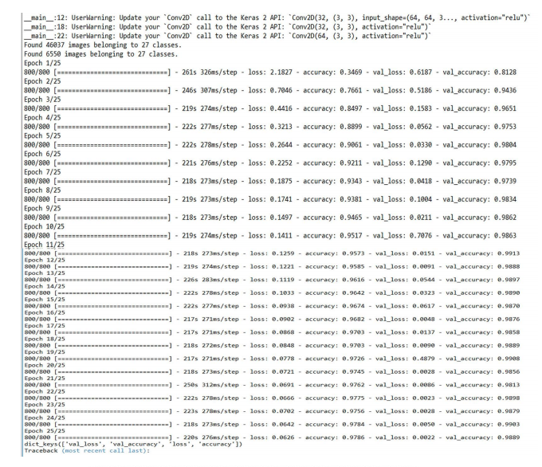
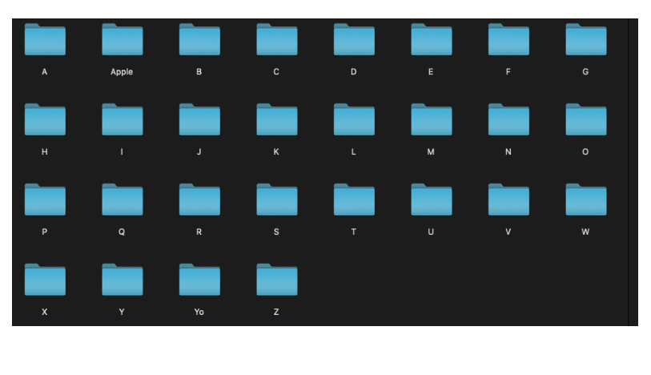
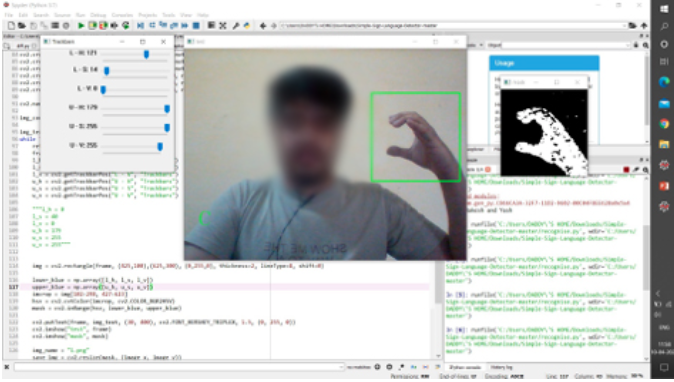
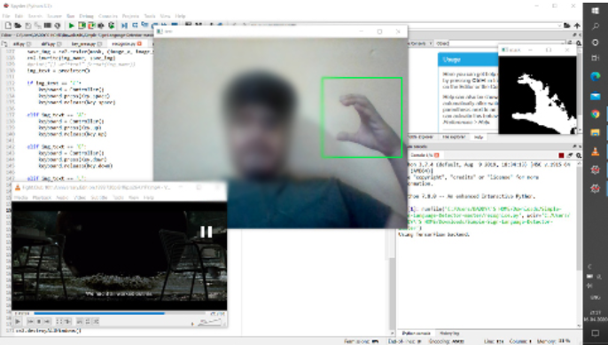

# HAPTIC-FEEDBACK-SYSTEM-FOR-DIFFERENTLY-ABLED-USING-THEIR-INPUTS
<h3><b>About : </b></h3>
To enable differently abled users not only interact with the modern computers but also explain their thoughts with other people, built a whole new interaction and feedback system for differently abled people to help them not only interact with the system in their sign language but also simultaneously receive a feedback, which helps them to interact with other people. The main objective of this project is to build a system which can increase the HCI (Human Computer Interaction) for the people who are differently abled and by which they can convey their message/thoughts to whom so ever they want to.

<h3><b>Objectives : </b></h3>

1. Capture the image of the sign as input and convert it into HLS (Hue, Lightness, Saturation) color space.
2. The converted image is then recognized by the model which will be trained with such sign images and will do the assigned action.
3. The recognized sign is then converted into audio format, the action done can be acknowledged to the user in the form of audio, which enhance the user interaction with the machine
4. Provide a completely new interface for the differently abled people to use and derive benefits of the modern technology and computers.

<h3><b>Approach & Outputs : </b></h3>

1. Capturing the dataset : Around 1500 images of 26 hand gestures were captured using the cv2 library. Binary mask for every gesture was created using HSL format.
Some of the masks are as follows :

2. Training the Model using CNN: Keras library is used to implement CNN model for training the model to detect gestures. Three convolutional layers and 50 epoch were used for better accuracy. A final .h5 file was used in the main code. Trained the system for around 26 gestures each having a dataset of around 1200-1500 images.

3. Detecting the gesture real time : Video capture of cv2 was used to capture the gesture real time.

4. Announcing the gesture ; making it disabled-friendly : After detecting the gesture , a message related to the it is announced using pyttsx library(text to speech conversion) to make it more disabled-friendly.

4. Extending these capabilities to an application - VLC Media Player :  Using  these  hand gestures , the user can control this application and perform some of the basic controls like - play, pause, volume up , volume down, forward and backward.

<h3><b>Dataset used : https://drive.google.com/drive/folders/1LZn87OmayhdNEt_lhWK355h_tO3duTl6?usp=sharing </b></h3>

<h3><b> Research papers : </b></h3>
To know more about the theoritical concept behind this project , refer to the below mentioned research papers (published by our team):

1. Hitesh Kumar Sharma, Punit Kumar, Prashant Ahlawat, Nishank Parashar, Rakesh Soni, Yash Manchanda. DEEP LEARNING BASED ACCURATE HAND GESTURE RECOGNITION USING ENHANCED CNN MODEL. http://www.jcreview.com/?mno=45446 [Access: September 15, 2020]. doi:10.31838/jcr.07.18.92
2. Nishank Parashar, Rakesh Soni, Yash Manchanda and Tanupriya Choudhury, "3D Modelling of Human Hand with Motion Constraints," 2018 International Conference on Computational Techniques, Electronics and Mechanical Systems (CTEMS), Belgaum, India, 2018, pp. 124-128, doi: 10.1109/CTEMS.2018.8769229. https://ieeexplore.ieee.org/document/8769229 

<h3><b> Future Scope : </b></h3>
This system has the potential of minimise this communication barrier by working as a mediator between the computer and the person , and converting their sign language into a computer understandable language. By achieving higher accuracy , this can be used to control the whole computer using sign language.

